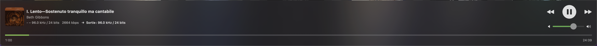
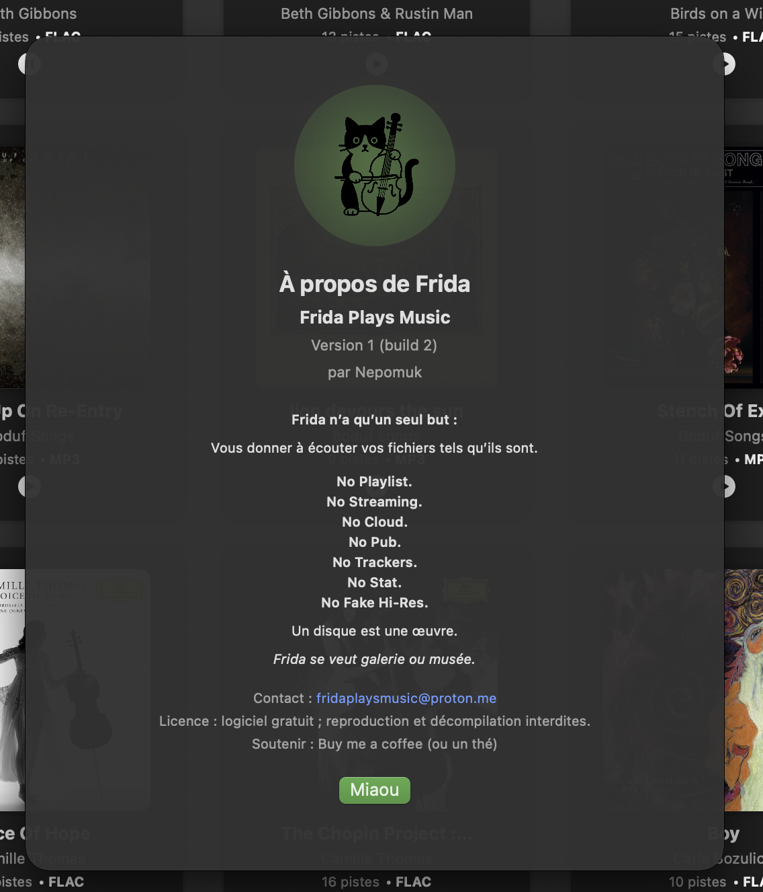

Frida Plays Music
=================

A macOS music player that treats every record like an artwork.  
No playlists. No streaming. No cloud. No trackers. No fake Hi-Res.

---

## What is Frida?

Frida is a macOS SwiftUI app (Apple Silicon & Intel) that plays **your local audio files — and nothing else**.

It offers:

- two playback engines  
  - a standard `AVAudioEngine` pipeline  
  - a BitPerfect path based on `HAL` (Hardware Abstraction Layer)
- a dark, gallery‑inspired UI with color halos derived from album art
- a deliberately minimal feature set: **no accounts, no network library, no streaming layer**

**Philosophy**  
> A record is an artwork. Frida is a small gallery for your own records, not a jukebox.

---

macOS compatibility
	•	Supported and tested: macOS Sequoia 15.x
  •	Not supported yet: macOS Sonoma 14.x
	•	Not supported yet: macOS Tahoe 26.x

Frida Plays Music is currently developed and validated on macOS Sequoia.
Support for Sonoma and Tahoe will be added later, once full testing has been performed — especially for audio stability (AVAudioEngine + HAL/BitPerfect), which can behave differently across macOS versions.

---

## Core Features

### Library Management

- Import folders of **FLAC / MP3 / WAV**;  
- Parse **CUE** sheets into individual tracks;
- Maintain “logical albums” (multi‑disc / multi‑folder) in a **SQLite** library;
- Backup the library to a user‑chosen folder;
- Export the library as **CSV**;
- Migrate an older JSON library to SQLite via a dedicated menu action;
- Clear the entire library (with confirmation dialog);
- Delete a single album (with confirmation dialog).

### Audio Engines

**Standard engine — AVAudioEngine**

- Plays FLAC/MP3/WAV via `AVAudioFile` and `AVAudioEngine`;
- Schedules CUE segments per track;
- Automatically plays the next track at the end of the current one;
- Supports pause / stop / resume;
- Re‑initializes the engine cleanly after an output device change.

**BitPerfect engine — HAL**

- Uses a `HAL` (Hardware Abstraction Layer) output AudioUnit for raw playback;
- Reads and pushes PCM data directly to the device;
- Checks format compatibility before starting playback:

  - PCM Int16 or Float32  
  - 1–8 channels  
  - sample rate up to 384 kHz

- If the device/format combination is not compatible, Frida automatically:

  - stops the HAL path,
  - disables BitPerfect for this session,
  - restarts the same track using the standard `AVAudioEngine` engine.

In **both** modes:

- when the mode is changed (standard ↔ BitPerfect), the track is restarted from the beginning (position is not preserved);
- track end triggers an automatic “play next” in the current album.

---

## Output Device Handling

Frida does not manage its own private device graph. It always uses the **system default output**.

- Lists all CoreAudio output devices (including AirPlay) in a small popover;
- Lets you choose an output device from inside the app;
- Changes the **system default device** when you select one in the popover;
- Persists your preferred device in user defaults;
- Shows a small warning toast for devices where BitPerfect is **not guaranteed** (AirPlay, docks, aggregates, etc.).

When you change device:

- the standard engine (`AVAudioEngine`) is fully stopped and rebuilt,
- the current track, if playing, starts again from the beginning,
- the BitPerfect engine recreates its HAL AudioUnit on the next play with the new default device.

---

## Album Views & Playback UI

### Library Grid

- Main view is a grid of albums, grouped by artist and alphabet (A–Z + “#”);
- Multi‑disc / multi‑folder albums are merged into **logical albums**;
- Search by artist to quickly jump within the grid;
- Auto‑scroll to the last imported album or to the selected artist.

### Album Detail View

For each album you can:

- edit the album title and artist;
- edit individual track titles and CD numbers;
- see the album type (CUE / mixed / FLAC / MP3 / WAV / generic);
- see the total number of tracks and duration;
- enjoy a **color halo** around the artwork, based on the dominant color of the cover;
- save changes to the library;
- delete the album (with confirmation).

### Now Playing, Tracklist Popover, MiniPlayer

**NowPlaying View**

- Shows current track title and artist;
- Displays “CD X · Track Y” when relevant;
- Displays format information: `X.Y kHz / N bits`;
- Shows the current bitrate (or `--- kbps` when unknown);
- Displays a short description of the current output device;
- Uses a color halo derived from the current artwork;
- Provides controls: previous / play‑pause / next.

**TracklistPopover**

- Opened from the NowPlaying area when the mini‑player is **not** detached;
- Lists tracks with CD number, track index, and duration;
- Lets you jump to a track inside the album.

**Detached MiniPlayer**

- A small, borderless window with blurred background and rounded corners;
- Mirrors the main playback controls and state;
- Disables the TracklistPopover while it is open, to avoid UI conflicts.

---

## Localization

- **Languages**: English and French.
- If macOS is set to French, the entire UI is in French.
- Any other system language falls back to English.

Localized elements include:

- menu items,
- toasts and alerts,
- the BitPerfect information overlay,
- About window texts,
- album / track info labels,
- output device warnings,
- default titles for CUE parsing.

---

## Technical Capabilities

- Supported formats: **FLAC**, **MP3**, **WAV**, plus **CUE** sheets for track indexing.
- Library stored in **SQLite** (via `FridaDatabase` and repository layer).
- Logical album model for multi‑disc sets.
- Mode switching and playback logic centralized in `LibraryManager.loadAndPlay`.
- BitPerfect mode toggled via a single UI control, backed by UserDefaults.
- `AVAudioEngine` handles format conversions internally via `AVAudioFile`.
- HAL path pushes raw PCM as‑is; no sample‑rate conversion or DSP is applied there.

---

## Design Choices & Limitations

These are **intentional**:

- No playlists, no radio, no streaming: Frida only plays what is on your drives.
- No cloud library, no user account, no telemetry.
- No “smart” re‑ordering: albums are played as they are, track after track.

Current technical limitations:

- Changing the output device **always restarts** playback from the beginning of the current track (no crossfade, no position resume).
- BitPerfect is **not** guaranteed on AirPlay, docks, or aggregate devices; Frida falls back to the standard engine if the HAL format negotiation fails.
- Metadata parsing is intentionally basic; album type is inferred from file extensions and CUE presence.
- Some popovers / tooltips can be tight with very long translations, although all visible strings are localized.

---

## Screenshots

<table>
  <tr>
    <td align="center">
      <strong>Library</strong> 
      
    </td>
    <td align="center">
      <strong>Now Playing</strong> 
      
    </td>
  </tr>
  <tr>
    <td align="center">
      <strong>Album detail</strong> 
      
    </td>
    <td align="center">
      <strong>Tracklist popup</strong> 
      
    </td>
  </tr>
  <tr>
    <td align="center">
      <strong>Mini player</strong> 
      
    </td>
    <td align="center">
      <strong>About window</strong> 
      
    </td>
  </tr>
</table>

---

## Why Frida Exists

Frida is a quiet refusal of streaming fatigue.

Instead of endless feeds, recommendations, and fake “Hi‑Res”, Frida offers:

- your own files,
- played exactly as they are,
- in a small, quiet macOS app.

> A record is an artwork. Frida tries to behave like a gallery or a museum:  
> you come in, you choose a record, you listen.

---

## Download

The app will be distributed via **GitHub Releases**.  
(Download link will appear here when the first public build is published.)

---

## License

- Free **binary** software.
- **Reproduction and decompilation are forbidden.**
- Source code is not distributed with the app.

---

## Bug Reports

Frida is a handcrafted app.  
Like any piece of software, it may contain imperfections — and the author is genuinely grateful when they are reported.

If you encounter a bug or an unexpected behaviour, feel free to write to:

**fridaplaysmusic@proton.me**

At the moment, Frida has been fully tested on macOS **Sequoia**.  
It has **not yet been tested on the latest macOS release**.

## Support / Contact

- Email: **fridaplaysmusic@proton.me**  
- “Buy me a ko-fi (or a tea)”: https://ko-fi.com/fridaplaysmusic

Credits: **Nepomuc**

---

## Version Française

### Qu’est‑ce que Frida ?

Frida est une app macOS SwiftUI (Apple Silicon & Intel) qui lit **uniquement vos fichiers audio locaux**.

Elle propose :

- deux moteurs de lecture  
  - un pipeline standard `AVAudioEngine`  
  - un chemin BitPerfect basé sur `HAL`
- une interface sombre inspirée d’une galerie, avec des halos de couleur issus des pochettes
- un choix assumé de minimalisme : pas de compte, pas de bibliothèque en ligne, pas de streaming

**Philosophie**  
> « Un disque est une œuvre. »  
> Frida se veut plus proche d’une galerie ou d’un musée que d’un juke‑box.

---

### Fonctionnalités principales

#### Bibliothèque

- Import de dossiers **FLAC / MP3 / WAV** ;  
- Parsing des fichiers **CUE** en pistes individuelles ;
- Gestion d’“albums logiques” multi‑disques / multi‑dossiers sous **SQLite** ;
- Sauvegarde de la bibliothèque vers un dossier choisi par l’utilisateur ;
- Export de la bibliothèque en **CSV** ;
- Migration d’une ancienne bibliothèque JSON vers SQLite via un menu dédié ;
- Effacement complet de la bibliothèque (avec alerte de confirmation) ;
- Suppression d’un album (avec alerte de confirmation).

#### Moteurs audio

**Moteur standard — AVAudioEngine**

- Lecture des FLAC/MP3/WAV via `AVAudioFile` et `AVAudioEngine` ;
- Scheduling des segments CUE piste par piste ;
- Passage automatique à la piste suivante en fin de lecture ;
- Gestion pause / stop / reprise ;
- Redémarrage propre du moteur après changement de sortie audio.

**Moteur BitPerfect — HAL**

- Utilise une AudioUnit de sortie `HAL` pour un flux brut vers le périphérique ;
- Envoie directement des données PCM vers la sortie ;
- Vérifie la compatibilité format/périphérique avant de démarrer :

  - PCM Int16 ou Float32  
  - 1 à 8 canaux  
  - fréquence d’échantillonnage jusqu’à 384 kHz

- En cas d’incompatibilité, Frida :

  - stoppe le chemin HAL,  
  - désactive le BitPerfect pour cette session,  
  - relance la même piste via le moteur standard `AVAudioEngine`.

Dans les **deux** modes :

- un changement de mode (standard ↔ BitPerfect) relance la piste depuis le début (la position n’est pas conservée) ;
- la fin de piste déclenche automatiquement la lecture de la piste suivante de l’album.

---

### Gestion des périphériques audio

Frida ne gère pas un graphe audio privé : elle utilise toujours le **périphérique de sortie par défaut du système**.

- Liste les périphériques de sortie CoreAudio (AirPlay inclus) dans un petit popover ;
- Permet de choisir un périphérique depuis l’app ;
- Modifie le **périphérique par défaut macOS** lorsque vous en sélectionnez un ;
- Mémorise le périphérique préféré dans les préférences utilisateur ;
- Affiche un petit avertissement lorsque le BitPerfect n’est **pas garanti** (AirPlay, docks, périphériques agrégés, etc.).

Lors d’un changement de périphérique :

- le moteur standard (`AVAudioEngine`) est stoppé puis reconstruit ;
- la piste en cours, si elle joue, repart depuis le début ;
- le moteur BitPerfect recrée son AudioUnit HAL au prochain play avec le nouveau périphérique par défaut.

---

### Vues Album / NowPlaying / MiniPlayer

**Grille de bibliothèque**

- Vue principale sous forme de grille d’albums, regroupés par artiste et par alphabet (A–Z + « # ») ;
- Gestion des albums multi‑disques / multi‑dossiers sous forme d’**albums logiques** ;
- Recherche par artiste pour naviguer rapidement dans la grille ;
- Auto‑scroll vers le dernier album importé ou vers l’artiste ciblé.

**Vue détail d’album**

Pour chaque album, il est possible de :

- modifier le titre d’album et l’artiste ;
- modifier les titres de piste et les numéros de CD ;
- voir le type d’album (CUE / mixte / FLAC / MP3 / WAV / générique) ;
- voir le nombre total de pistes et la durée ;
- afficher un **halo de couleur** autour de la pochette, calculé à partir de sa couleur dominante ;
- sauvegarder les modifications dans la bibliothèque ;
- supprimer l’album (avec confirmation).

**NowPlaying, TracklistPopover, MiniPlayer détaché**

- NowPlaying affiche : titre, artiste, « CD X · Piste Y » le cas échéant, format (`X.Y kHz / N bits`), bitrate, description de la sortie, halo couleur, boutons précédent/play‑pause/suivant.
- TracklistPopover s’ouvre depuis NowPlaying (sauf si le mini‑player est détaché), liste les pistes avec CD, index et durée, permet de sauter à une piste.
- Le MiniPlayer détaché est une petite fenêtre sans bord, au fond flouté et aux coins arrondis, qui reflète l’état de lecture et désactive temporairement le TracklistPopover.

---

### Localisation

- **Langues** : anglais et français.  
- Si macOS est en français, l’interface est en français.  
- Pour toute autre langue système, Frida utilise l’anglais.

Sont localisés : menus, toasts et alertes, overlay BitPerfect, fenêtre About, labels album/pistes, avertissements sur les sorties, valeurs par défaut pour le parsing des CUE.

---

### Capacités techniques & limites assumées

- Formats : **FLAC**, **MP3**, **WAV**, avec support des fichiers **CUE** pour l’indexation des pistes.
- Bibliothèque stockée en **SQLite** (via `FridaDatabase`).
- Moteurs de lecture orchestrés dans `LibraryManager.loadAndPlay`.
- BitPerfect activé ou désactivé via un simple toggle (préférences utilisateur).
- `AVAudioEngine` gère les conversions de format via `AVAudioFile`.
- Le chemin HAL n’applique aucune conversion ni traitement.

Limites actuelles (et assumées) :

- Pas de playlists, pas de radio, pas de streaming : uniquement vos fichiers locaux.
- Pas de bibliothèque cloud, pas de compte, pas de télémétrie.
- Changement de sortie audio : le moteur est redémarré et la piste repart au début (pas de crossfade ni de reprise de position).
- BitPerfect non garanti sur AirPlay/docks/agrégats ; en cas de problème de format, Frida repasse en lecture standard.
- Parsing des métadonnées volontairement simple.

---

### Pourquoi Frida ?

Frida est un petit refus tranquille du bruit de fond du streaming.

Au lieu de flux infinis, de recommandations et de faux « Hi‑Res », Frida propose :

- vos propres disques,
- joués tels qu’ils sont,
- dans une petite app macOS discrète.

---

### Signalement de bugs

Frida est une application artisanale.  
Comme tout logiciel, elle peut contenir des imperfections — et l’auteur est sincèrement reconnaissant lorsqu’elles sont signalées.

Si vous rencontrez un bug ou un comportement étrange, vous pouvez écrire à :

**fridaplaysmusic@proton.me**

Pour l’instant, Frida a été entièrement testée sur macOS **Séquoia**.  
Elle **n’a pas encore été testée sur la dernière version de macOS**.

### Téléchargement

L’app sera distribuée via **GitHub Releases**.  
(Le lien de téléchargement sera ajouté ici lors de la première version publique.)

---

### Licence

- Logiciel gratuit, distribué sous forme de **binaire**.  
- **Reproduction et décompilation interdites.**  
- Le code source n’est pas fourni avec l’app.

---

### Support / Contact

- Email : **fridaplaysmusic@proton.me**  
- « Buy me a Ko-Fi (ou un thé) » : https://ko-fi.com/fridaplaysmusic

Crédits : **Nepomuc**
